# prueba-t-cnica
#### Tecnologias 

- Frontend VueJs
- Backend NodeJs
- BD Mongodb

####  Installation backend

```bash
cd backend
npm i
```

####  Run Backend

```bash
npm run start
```

####  Installation frontend

```bash
cd frontend
npm i
```

####  Run Backend

```bash
npm run serve
```

####  Vistas

Vista home
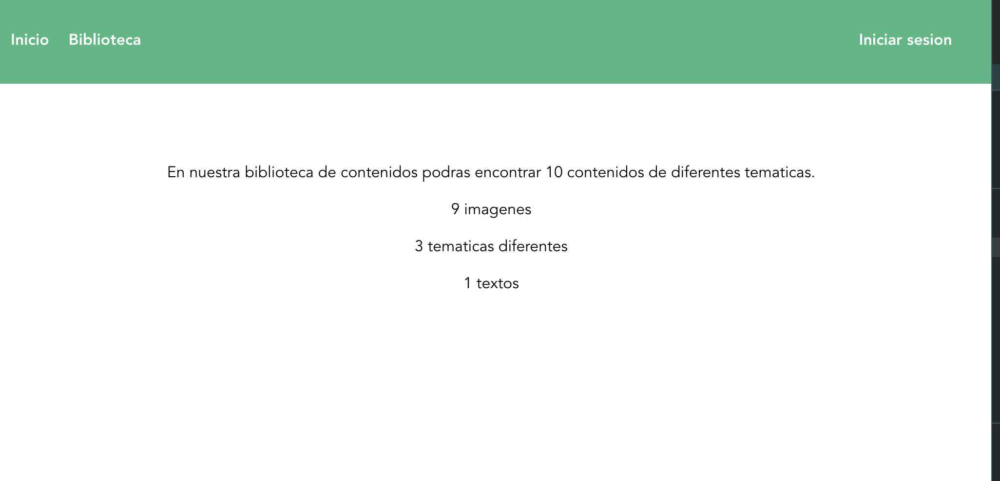

Vista login
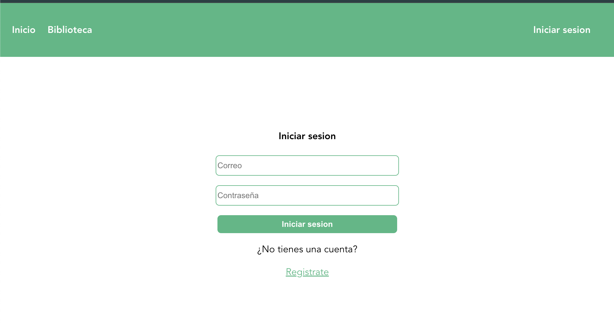

Vista signup
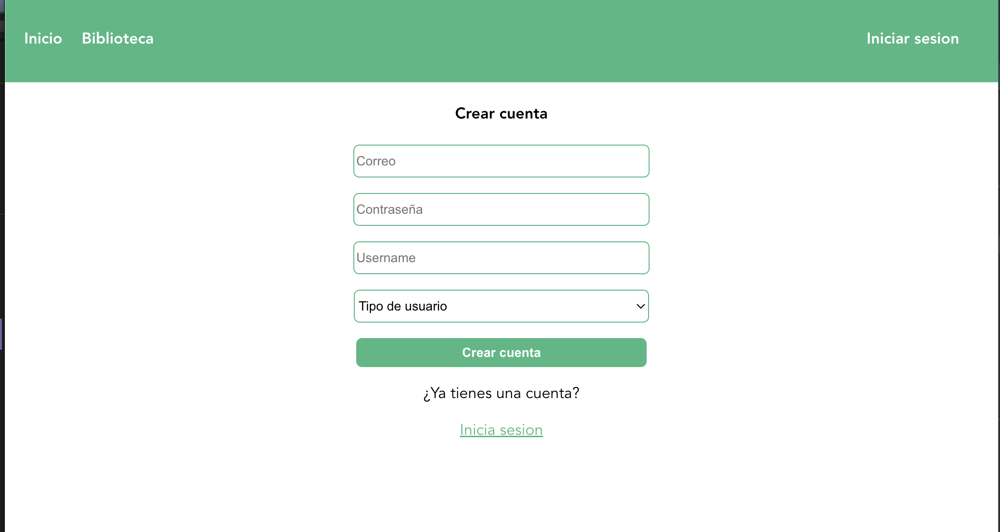

Vista vistante
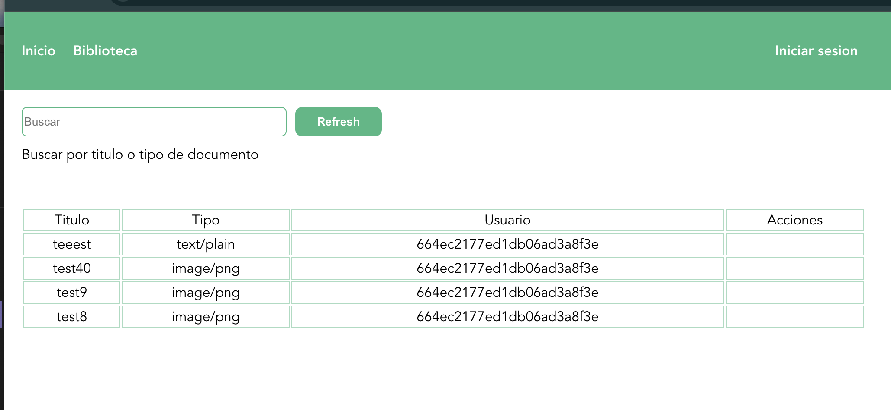

Vista lector
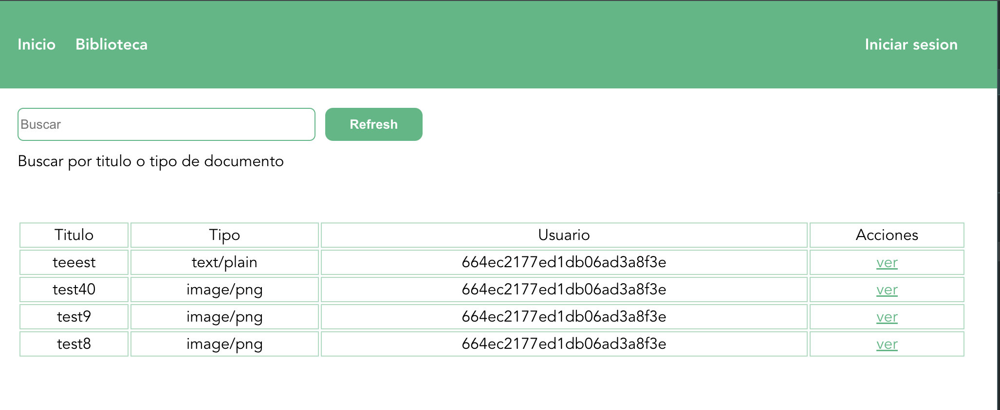

Vista creador
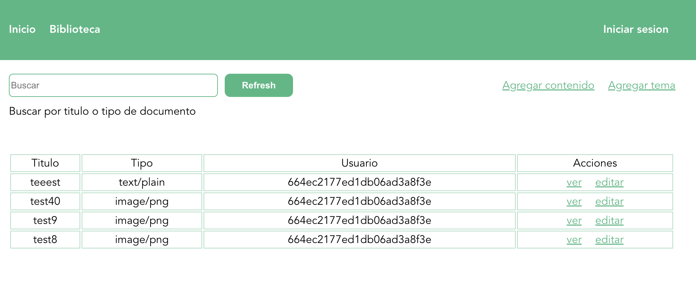

Vista vistante
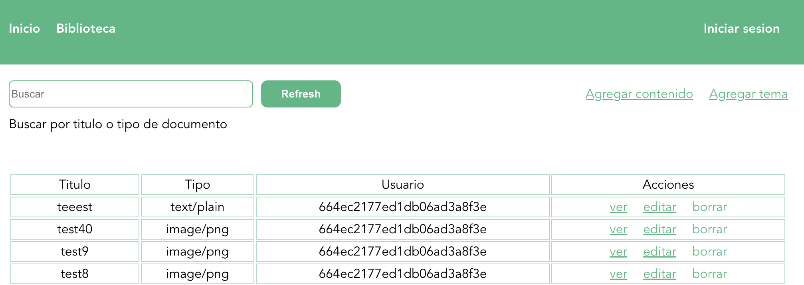

Vista detalle
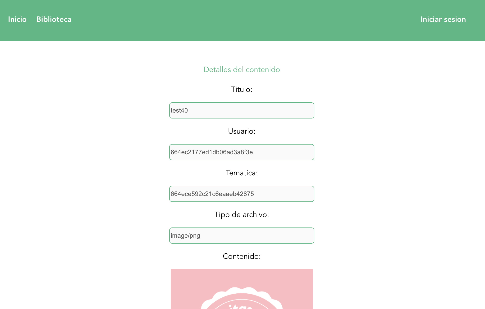

Vista agregar tematica
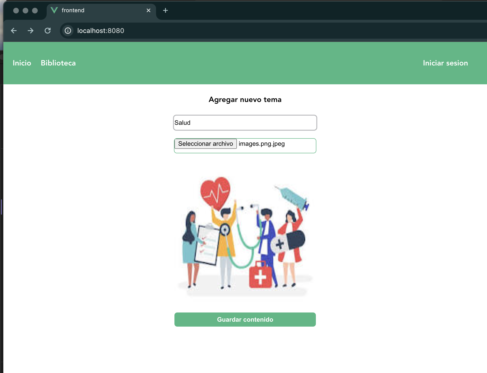

Vista agregar contenido
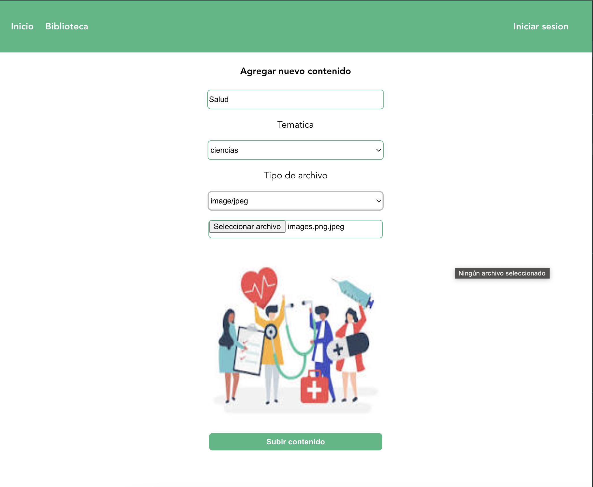

Vista editar contenido
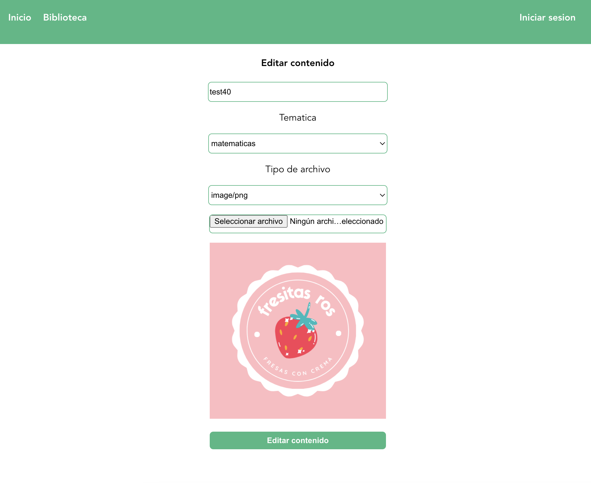


####  Comments
Una vez creado el usuario tipo admin, se deberas desconectar las lineas 19-23 del archivo backend/controllers/UserController.js para poder validar que solo usuarios tipo admin pueden crear usuarios tipo admin


